# 👋 ¡Hola! Soy Leslie Gonzales Vergara

Técnica en Desarrollo de Aplicaciones Multiplataforma (DAM). Actualmente enfocada en construir mi camino como desarrolladora, aprendiendo backend, concurrencia, arquitectura de software y bases de datos a través de proyectos reales.

## 🛠️ Tecnologías
Java · Python · Flutter · SQL · MongoDB · JavaFX · Git

## 🚀 Proyectos destacados

### 📈 Simulador de Bolsa
Simulador de mercado bursátil en tiempo real con concurrencia en Java (hilos, ExecutorService, BlockingQueue), patrones de diseño (Observer, Repository, Strategy), persistencia en MongoDB, interfaz JavaFX y datos reales de mercado vía Alpha Vantage.

🔗 [Ver repositorio](https://github.com/LeslieGV25/Simulador-bolsa-)

### 🍽️ Grupo Bravo — Sistema de gestión para restaurante
Proyecto de prácticas en equipo (6 personas): comandas, reservas, pagos y gestión multi-sucursal, con backend FastAPI + MongoDB, frontend Flutter y pagos con Stripe. Mi aportación: base de datos, backend del módulo de administración, integración con OpenStreetMap para geolocalización de pedidos, y parte del diseño de pantallas. También lideré la comunicación con el cliente, con resultado satisfactorio.

*(Repositorio privado por acuerdo del equipo — capturas a continuación)*

**Panel Global — gestión multi-sucursal (mi aportación principal)**

  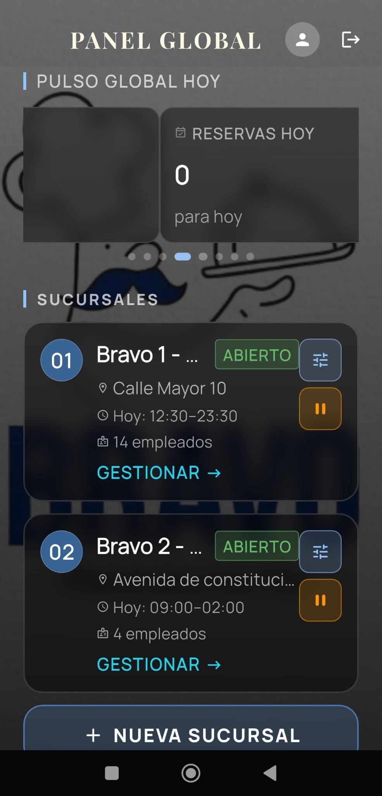
  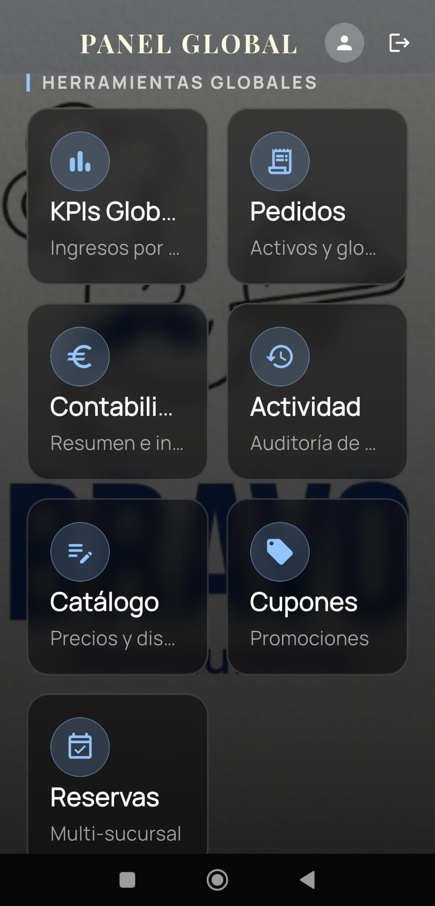

**Experiencia de cliente: pedido, pago y seguimiento en tiempo real**

  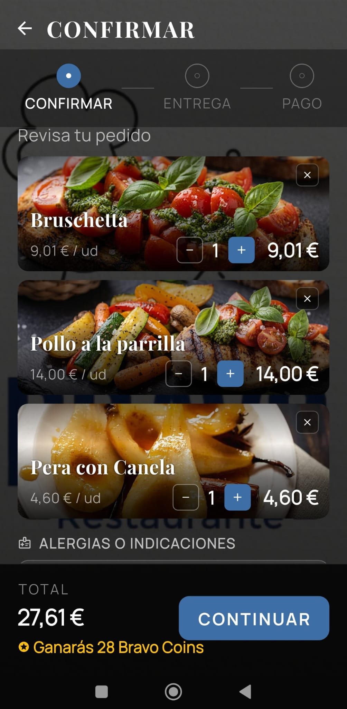
  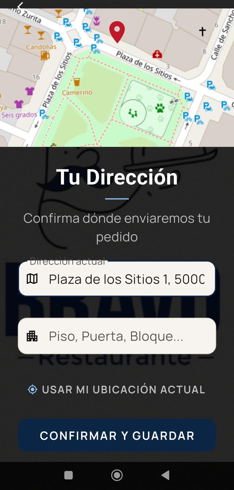
  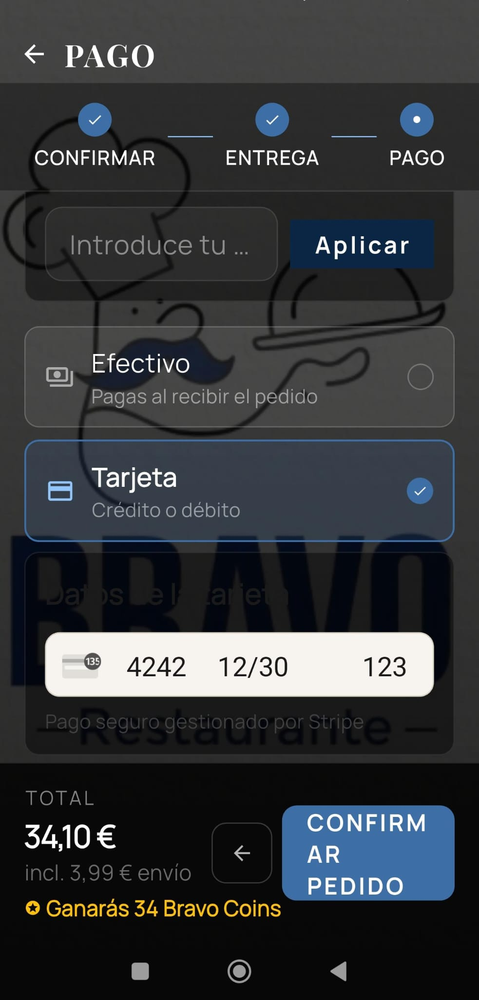
  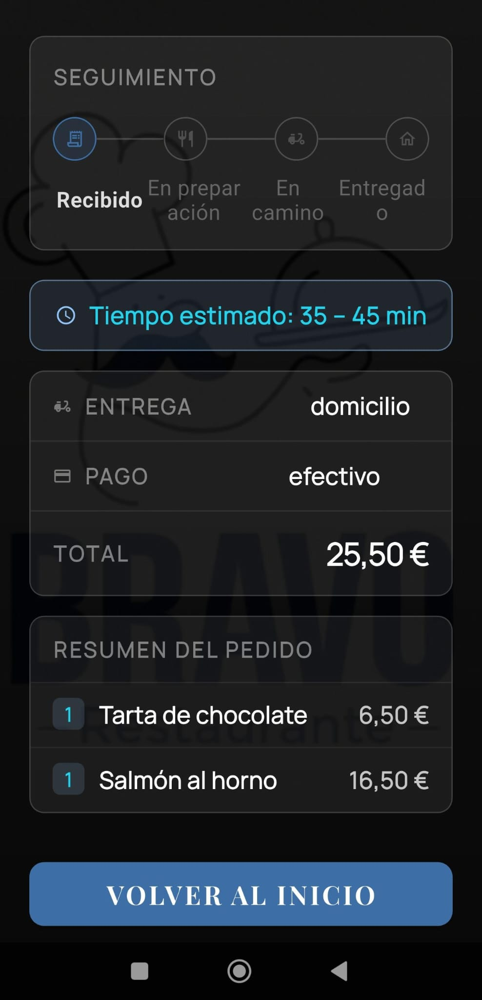

**Panel de camarero**

  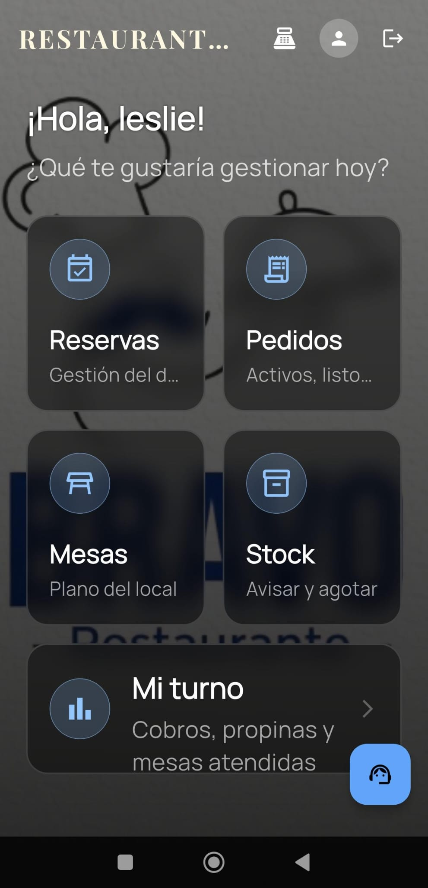

### 🏋️ AgendaInstructores — Gestión de agenda para gimnasio
App desarrollada junto a un compañero para un cliente real, resolviendo su problema de gestión de horarios de instructores. Stack: Flutter, Supabase (PostgreSQL + funciones edge), Firebase (notificaciones push).

Mi aportación: gestión comercial completa con el cliente (toma de requerimientos, negociación), configuración de la base de datos en Supabase, hosting en Firebase, notificaciones push, y participación en decisiones de diseño de interfaz.

*(Capturas de una versión de demo con datos genéricos)*

**Panel de administrador**

  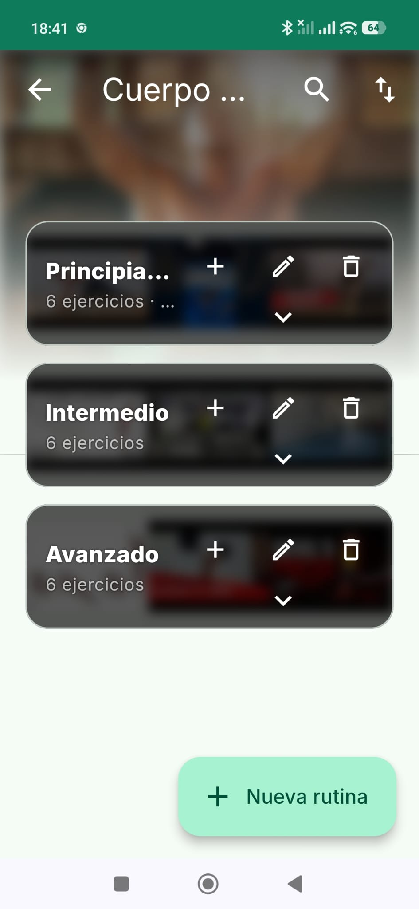
  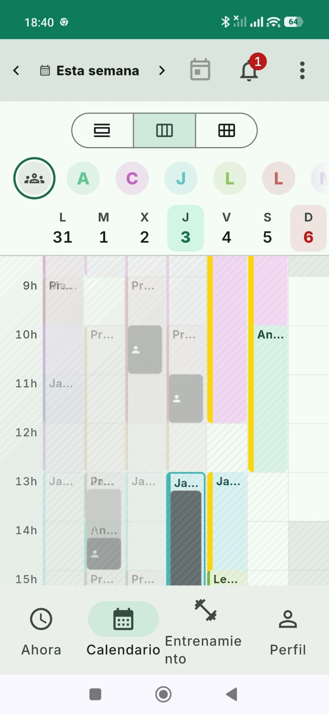

**Panel de instructor**

  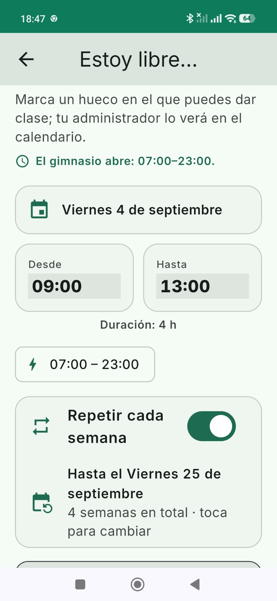
  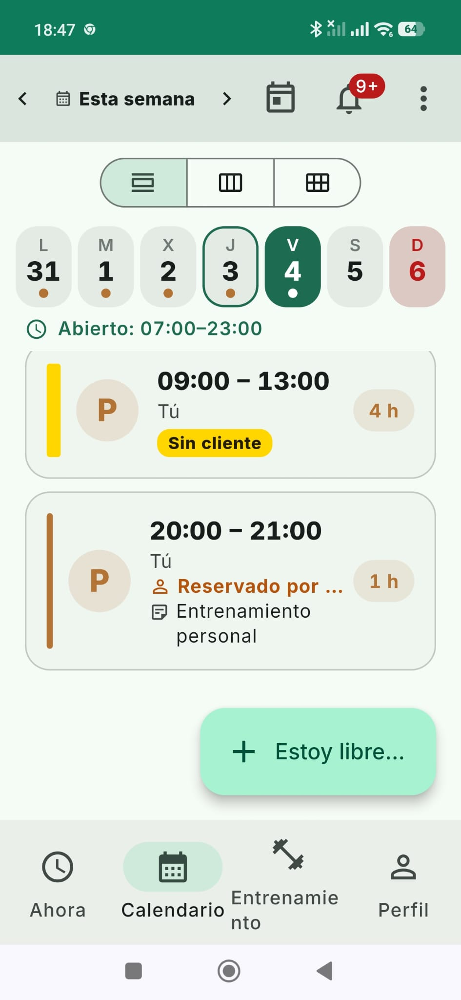

**Vista de cliente**

  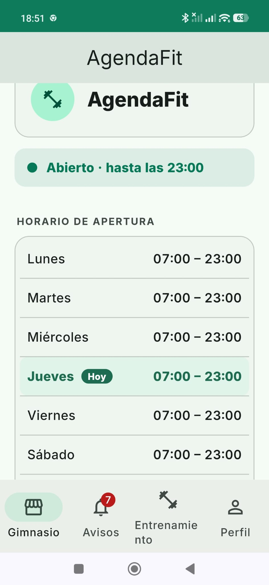
  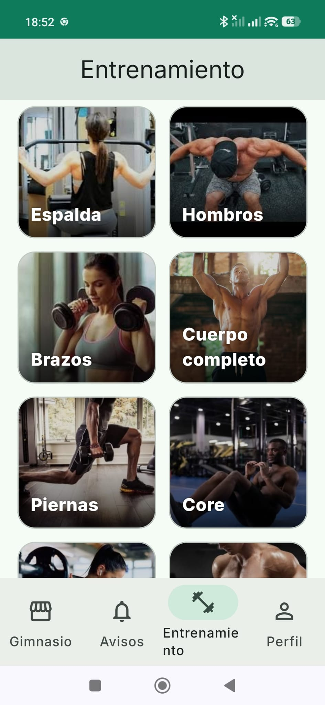

## 📫 Contacto
[LinkedIn](https://www.linkedin.com/in/leslie-gonzales-vergara-b65273416/) · [GitHub](https://github.com/LeslieGV25) 
